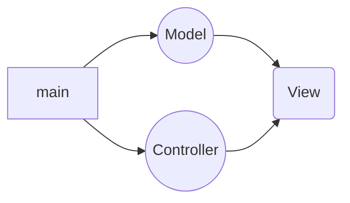

# Student attendance management web application

## Project Features

- Supper Admin
  - Controls everything
- Teachers Profile
  - Update Profile
  - Forgot Password
- Teachers Login
- Class Add
- Student Add by class
- Student remove
- Generate attendance report
- Download report in excel format
- **_More features may be added during the development._**

# Technology

- ## Frontend

  - HTML
  - CSS
  - JAVASCRIPT
  - BOOTSTRAP (If needed)

- ## Backend
  - GOLANG
    - gin (for api)
    - gorilla/mux (for router)
    - gorilla/session (for login authentication)
- ## Database

  - POSTGRESQL

## Api inpoint

```
GET       /api/class                
POST      /api/class              
PUT       /api/class/:id            
DELETE    /api/class/:id           
GET       /api/student              
POST      /api/student              
PUT       /api/student/:id         
DELETE    /api/student/:id          
GET       /api/user                 
POST      /api/user                 
PUT       /api/user/:id            
DELETE    /api/user/:id             
GET       /api/attendance  
```

- ## ORM

  - gorm (http://gorm.io)

- ## Coding pattern
  - MVC(Model-View-Controller)


